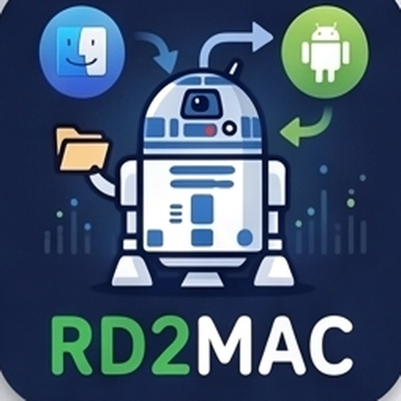
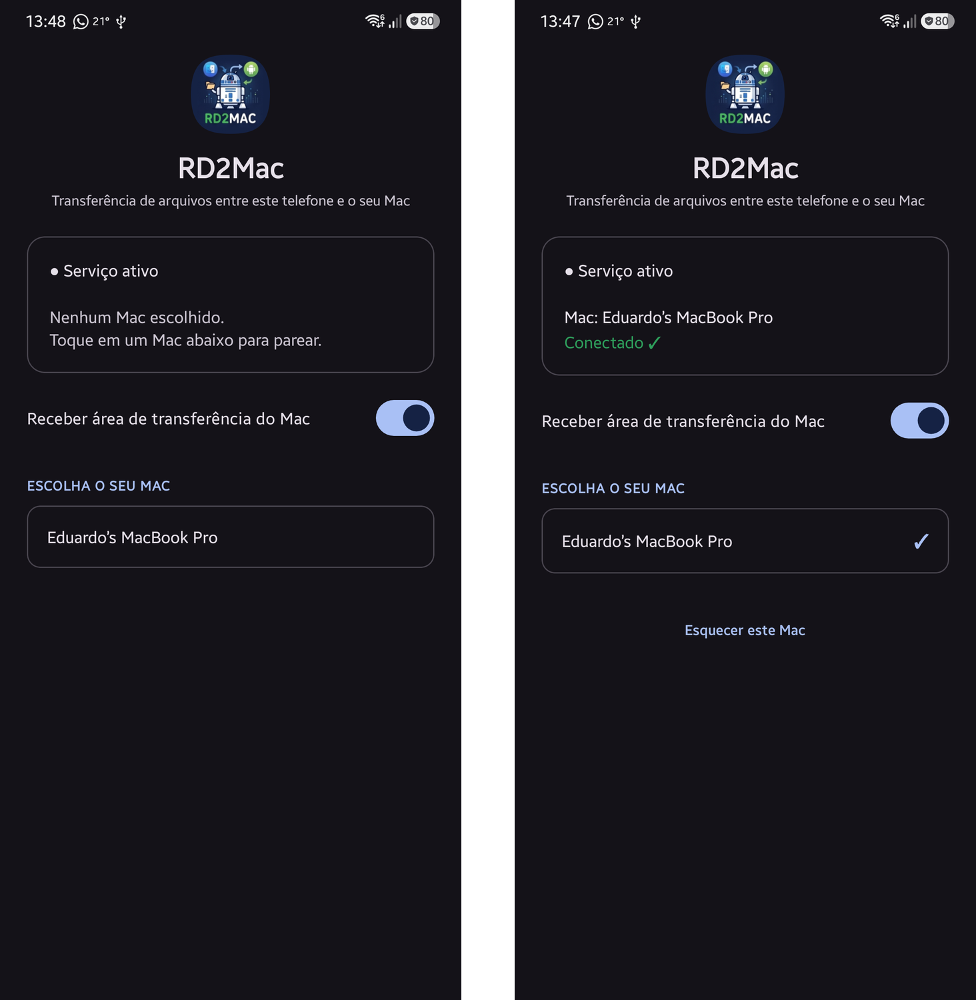

# 📲 RD2Mac

<a href="#-português">🇧🇷 Português</a> &nbsp;·&nbsp; <a href="#-english">🇬🇧 English</a>

Transferência **criptografada** de arquivos e área de transferência entre Android e Mac, pela Wi-Fi.
*Encrypted file & clipboard transfer between Android and macOS, over Wi-Fi.*

---

## 🇧🇷 Português

O **RD2Mac** transfere fotos, vídeos, arquivos e área de transferência entre um **telefone Android** e um **Mac**, pela rede Wi-Fi — sem cabo, sem nuvem, sem enviar nada para a internet. **Tudo é criptografado de ponta a ponta**, então é seguro usar em **qualquer lugar**, inclusive no Wi-Fi de hotel ou público.

São **dois aplicativos**: um no Mac e um no telefone. Instale **os dois primeiro**, depois pareie uma única vez — daí em diante é só usar.

> ⚠️ **Importante:** o telefone e o Mac precisam estar na **mesma rede Wi-Fi** (a de casa). Redes de convidado às vezes bloqueiam.

> 🔒 **Seguro em qualquer lugar.** A conversa entre os dois aparelhos é **criptografada de ponta a ponta** — ninguém na mesma Wi-Fi (nem em hotel ou rede pública) consegue ler o que você transfere, nem uma senha copiada. No **primeiro** pareamento aparece um **código de 6 números** nos dois aparelhos: confira que é o mesmo e confirme — isso garante que não há ninguém no meio. Depois, é só usar, sem digitar mais nada.

### 💻 Parte 1 — Instalar no Mac

1. Baixe o app: **[⬇️ RD2Mac.dmg](https://github.com/esimioni/rd2mac/releases/download/v0.1/RD2Mac.dmg)**.
2. Dê um **duplo clique** no **RD2Mac.dmg** — abre uma janelinha. **Arraste** o ícone do RD2Mac para cima da pasta **Aplicativos**.
3. Abra a pasta **Aplicativos** e dê um **duplo clique** no **RD2Mac** para abrir.
4. Na **primeira vez**, o Mac pode perguntar se o RD2Mac pode encontrar aparelhos na **rede local** — clique em **Permitir** (sem isso ele não acha o telefone).
5. Pronto: aparece um **ícone de telefone** na **barra do topo** da tela, perto do relógio 🕐.

Ainda **não pareie** agora — primeiro instale no telefone (Parte 2).

### 📱 Parte 2 — Instalar no telefone (Android)

1. No telefone, baixe o app: **[⬇️ RD2Mac.apk](https://github.com/esimioni/rd2mac/releases/download/v0.1/RD2Mac.apk)**. Depois abra o arquivo baixado (na barra de notificações ou na pasta **Downloads**).
2. O Android vai avisar que precisa de permissão para **instalar apps desta origem** — toque em **Configurações**, ligue **Permitir desta fonte** e volte.
3. Pode aparecer um aviso de segurança (Play Protect): toque em **Instalar mesmo assim**. O app é seguro — ele só não veio da loja Google Play.
4. Abra o **RD2Mac** e toque em **Permitir** quando ele pedir acesso a **fotos** e **notificações**.

### 🔗 Parte 3 — Parear (uma única vez)

Agora que o app está aberto nos **dois** aparelhos, e os dois na **mesma Wi-Fi**:

1. **No telefone**, embaixo de **ESCOLHA O SEU MAC**, toque no nome do seu Mac.
2. Aparece um **código de 6 números** nos **dois** aparelhos. Confira que é **o mesmo**.
3. Toque/clique em **Confirmar** nos dois. Fica **Conectado ✓**.

A tela do telefone é assim — **antes** de escolher (à esquerda) e **depois de conectado** (à direita):

> 💡 Depois de pareado, ele **lembra para sempre** — só muda se você mandar *Esquecer* e escolher outro.

### 🔄 Parte 4 — Usar no dia a dia

**📱 → 💻 Enviar do telefone para o Mac** — abra a foto ou o arquivo → botão **Compartilhar** → escolha **RD2Mac**. Chega na pasta **Downloads** do Mac, com um aviso de *enviado ✓*.

**💻 → 📱 Enviar do Mac para o telefone** — clique com o **botão direito** no arquivo → **Compartilhar** → **RD2Mac**. Fotos e vídeos vão para a **galeria** do telefone; o resto, para **Downloads**.

#### 📋 Copiar e colar entre os aparelhos (opcional)

Dá para copiar num aparelho e colar no outro, parecido com o Handoff da Apple.

- **Do Mac para o telefone:** no app do telefone, ligue **"Receber área de transferência do Mac"**. O que você copiar no Mac já pode ser colado no telefone. Deixe desligado quando não quiser.
- **Do telefone para o Mac:** adicione o atalho **"Enviar p/ Mac"** às Configurações Rápidas (arraste a barra de cima para baixo → ✏️ *Editar* → arraste o atalho do RD2Mac). Copie algo e toque no atalho. No Mac, ligue **"Receber área de transferência do telefone"** no menu.

### ❓ Se algo não funcionar

- **O telefone (ou o Mac) não aparece na lista?** Confirme que os dois estão na **mesma rede Wi-Fi**.
- Evite a Wi-Fi de **convidado** — costuma bloquear. Use a rede normal de casa.
- Ainda nada? **Feche e abra** o aplicativo de novo, nos dois lados.

---

## 🇬🇧 English

**RD2Mac** moves photos, videos, files and the clipboard between an **Android phone** and a **Mac** over Wi-Fi — no cable, no cloud, nothing sent to the internet. **Everything is end-to-end encrypted**, so it's safe to use **anywhere**, including hotel or public Wi-Fi.

There are **two apps**: one on the Mac, one on the phone. Install **both first**, then pair once — after that, just use it.

> ⚠️ **Important:** the phone and the Mac must be on the **same Wi-Fi** (your home network). Guest networks sometimes block it.

> 🔒 **Safe anywhere.** The two devices talk **end-to-end encrypted** — nobody on the same Wi-Fi (hotel or public included) can read what you transfer, not even a copied password. On the **first** pairing a **6-digit code** shows on both devices: check it's the same and confirm — that rules out a man-in-the-middle. After that, just use it, nothing to type.

### 💻 Part 1 — Install on the Mac

1. Download the app: **[⬇️ RD2Mac.dmg](https://github.com/esimioni/rd2mac/releases/download/v0.1/RD2Mac.dmg)**.
2. **Double-click** **RD2Mac.dmg** — a window opens. **Drag** the RD2Mac icon onto the **Applications** folder.
3. Open **Applications** and **double-click** **RD2Mac**.
4. The **first time**, the Mac may ask if RD2Mac can find devices on the **local network** — click **Allow** (otherwise it won't find the phone).
5. Done: a **phone icon** appears in the **menu bar** at the top, near the clock 🕐.

Don't pair yet — install on the phone first (Part 2).

### 📱 Part 2 — Install on the phone (Android)

1. On the phone, download the app: **[⬇️ RD2Mac.apk](https://github.com/esimioni/rd2mac/releases/download/v0.1/RD2Mac.apk)**. Then open the downloaded file (from the notification shade or the **Downloads** folder).
2. Android will ask for permission to **install apps from this source** — tap **Settings**, turn on **Allow from this source**, and go back.
3. A Play Protect warning may appear: tap **Install anyway**. The app is safe — it just didn't come from the Google Play store.
4. Open **RD2Mac** and tap **Allow** for **photos** and **notifications**.

### 🔗 Part 3 — Pair (one time)

With the app open on **both** devices, both on the **same Wi-Fi**:

1. **On the phone**, under **CHOOSE YOUR MAC**, tap your Mac's name.
2. A **6-digit code** shows on **both** devices. Check it's **the same**.
3. Tap/click **Confirm** on both. It shows **Connected ✓**.

The phone screen looks like this — **before** choosing (left) and **once connected** (right):

> 💡 Once paired, it's remembered **for good** — it only changes if you **Forget** and pick another.

### 🔄 Part 4 — Everyday use

**📱 → 💻 Phone to Mac** — open the photo or file → **Share** → pick **RD2Mac**. It lands in the Mac's **Downloads**, with a *sent ✓* toast.

**💻 → 📱 Mac to phone** — **right-click** the file → **Share** → **RD2Mac**. Photos and videos go to the phone's **gallery**; everything else to **Downloads**.

#### 📋 Copy & paste between devices (optional)

Copy on one device, paste on the other — like Apple's Handoff.

- **Mac → phone:** in the phone app, turn on **"Receive clipboard from the Mac"**. What you copy on the Mac can be pasted on the phone. Leave it off when you don't want it.
- **Phone → Mac:** add the **"Send to Mac"** tile to Quick Settings (pull down the top bar → ✏️ *Edit* → drag the RD2Mac tile in). Copy something and tap the tile. On the Mac, turn on **"Receive clipboard from phone"** in the menu.

### ❓ If something doesn't work

- **Phone (or Mac) not in the list?** Make sure both are on the **same Wi-Fi**.
- Avoid **guest** Wi-Fi — it usually blocks this. Use your normal home network.
- Still nothing? **Close and reopen** the app on both sides.
