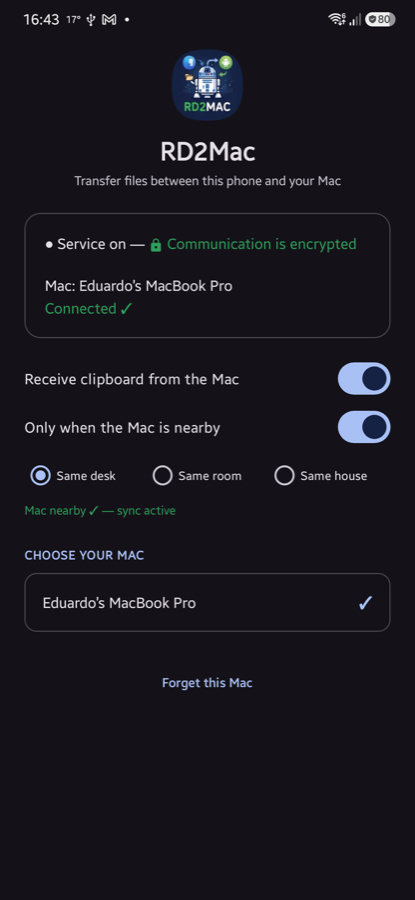

# 📲 RD2Mac

<a href="#-português">🇧🇷 Português</a> &nbsp;·&nbsp; <a href="#-english">🇬🇧 English</a>

Transferência **criptografada** de arquivos e área de transferência entre Android e Mac, pela Wi-Fi.
*Encrypted file & clipboard transfer between Android and macOS, over Wi-Fi.*

---

## 🇧🇷 Português

O **RD2Mac** transfere fotos, vídeos, arquivos e área de transferência entre um **telefone Android** e um **Mac**, pela rede Wi-Fi — sem cabo, sem nuvem, sem enviar nada para a internet. **Tudo é criptografado de ponta a ponta**, então é seguro usar em **qualquer lugar**, inclusive no Wi-Fi de hotel ou público.

São **dois aplicativos**: um no Mac e um no telefone. Instale **os dois primeiro**, depois pareie uma única vez — daí em diante é só usar.

> ⚠️ **Importante:** o telefone e o Mac precisam estar na **mesma rede Wi-Fi**. **Recomendamos parear na Wi-Fi de casa:** redes públicas ou de convidados (hotel, aeroporto, escritório) costumam ter **isolamento entre dispositivos** (*client isolation*) — os aparelhos não conseguem se enxergar nem conversar diretamente. Nessas redes, o pareamento e até a **transferência de arquivos e da área de transferência** podem não funcionar, mesmo com os dois conectados na mesma rede.

> 🔒 **Seguro em qualquer lugar.** A conversa entre os dois aparelhos é **criptografada de ponta a ponta** — ninguém na mesma Wi-Fi (nem em hotel ou rede pública) consegue ler o que você transfere, nem uma senha copiada. No **primeiro** pareamento aparece um **código de 6 números** nos dois aparelhos: confira que é o mesmo e confirme — isso garante que não há ninguém no meio. Depois, é só usar, sem digitar mais nada.

### 💻 Parte 1 — Instalar no Mac

1. Baixe o app: **[⬇️ RD2Mac.dmg](https://github.com/esimioni/rd2mac/releases/download/v0.3/RD2Mac.dmg)**.
2. Dê um **duplo clique** no **RD2Mac.dmg** — abre uma janelinha. **Arraste** o ícone do RD2Mac para cima da pasta **Aplicativos**.
3. Abra a pasta **Aplicativos** e dê um **duplo clique** no **RD2Mac** para abrir.
4. Na **primeira vez**, o Mac pode perguntar se o RD2Mac pode encontrar aparelhos na **rede local** — clique em **Permitir** (sem isso ele não acha o telefone).
5. Pronto: aparece um **ícone de telefone** na **barra do topo** da tela, perto do relógio 🕐.

Ainda **não pareie** agora — primeiro instale no telefone (Parte 2).

### 📱 Parte 2 — Instalar no telefone (Android)

1. No telefone, baixe o app: **[⬇️ RD2Mac.apk](https://github.com/esimioni/rd2mac/releases/download/v0.3/RD2Mac.apk)**. Depois abra o arquivo baixado (na barra de notificações ou na pasta **Downloads**).
2. O Android vai avisar que precisa de permissão para **instalar apps desta origem** — toque em **Configurações**, ligue **Permitir desta fonte** e volte.
3. Pode aparecer um aviso de segurança (Play Protect): toque em **Instalar mesmo assim**. O app é seguro — ele só não veio da loja Google Play.
4. Abra o **RD2Mac** e toque em **Permitir** quando ele pedir acesso a **fotos** e **notificações**.

### 🔗 Parte 3 — Parear (uma única vez)

Agora que o app está aberto nos **dois** aparelhos, e os dois na **mesma Wi-Fi**:

1. **No telefone**, embaixo de **ESCOLHA O SEU MAC**, toque no nome do seu Mac.
2. Aparece um **código de 6 números** nos **dois** aparelhos. Confira que é **o mesmo**.
3. Toque/clique em **Confirmar** nos dois. Fica **Conectado ✓** — e um **cadeado verde 🔒** aparece nos dois lados (no telefone, *"Comunicação criptografada"*; no menu do Mac, junto ao nome do telefone), confirmando que a conexão está criptografada.

A tela do telefone **conectada** fica assim (cadeado verde + Conectado ✓):

> 💡 Depois de pareado, ele **lembra para sempre** — só muda se você mandar *Esquecer* e escolher outro.

### 🔄 Parte 4 — Usar no dia a dia

**📱 → 💻 Enviar do telefone para o Mac** — abra a foto ou o arquivo → botão **Compartilhar** → escolha **RD2Mac**. Chega na pasta **Downloads** do Mac, com um aviso de *enviado ✓*.

**💻 → 📱 Enviar do Mac para o telefone** — clique com o **botão direito** no arquivo → **Compartilhar** → **RD2Mac**. Fotos e vídeos vão para a **galeria** do telefone; o resto, para **Downloads**.

#### 📋 Copiar e colar entre os aparelhos (opcional)

Dá para copiar num aparelho e colar no outro, parecido com o Handoff da Apple.

- **Do Mac para o telefone:** no app do telefone, ligue **"Receber área de transferência do Mac"**. O que você copiar no Mac já pode ser colado no telefone. Deixe desligado quando não quiser.
- **Do telefone para o Mac:** primeiro adicione o botão do RD2Mac às **Configurações Rápidas** — o painel que desce quando você arrasta a barra do topo:
  1. Arraste a barra do topo para baixo **duas vezes** (abre o painel completo).
  2. Toque no **lápis ✏️** (em alguns aparelhos fica em **⋮ → Editar botões** — o nome varia por marca, mas sempre há um "editar" no painel).
  3. Ache **"Enviar p/ Mac"** entre os botões disponíveis e **arraste** para a área dos botões ativos. Toque em **Concluir**.

  No dia a dia: **copie** algo, desça a barra e **toque em "Enviar p/ Mac"** — pronto, já dá para colar no Mac. (No Mac, deixe ligado **"Receber área de transferência do telefone"** no menu.)
- **Só com o Mac por perto (opcional):** ligue **"Somente com o Mac por perto"** no app do telefone para o recebimento automático pausar sozinho quando você se afastar (escolha o alcance: **Mesma mesa**, **Mesma sala** ou **Mesma casa**). O telefone detecta o Mac por Bluetooth, e o menu do Mac mostra **"Telefone por perto / longe"**. O atalho "Enviar p/ Mac" continua funcionando sempre, perto ou longe.

#### 🤖 Puxar arquivos com um assistente de IA (opcional, avançado)

Se você usa um **assistente de IA com acesso ao terminal** do computador (como o **Claude Code**), pode pedir coisas como *"puxe os últimos 3 prints do meu telefone"* — sem tocar no aparelho. Ele busca os arquivos e já os lê para você.

1. **Ative a ferramenta:** clique no ícone do RD2Mac na barra do topo do Mac → **Install command-line tool…** (pode pedir sua senha uma vez).
2. **Ensine seu assistente:** cole o texto abaixo nas instruções dele (por exemplo, no arquivo `CLAUDE.md`). Sem isso, ele não sabe que a ferramenta existe.

> Este Mac tem o comando `rd2mac`, que move arquivos entre o Mac e meu telefone pela Wi-Fi (o app RD2Mac precisa estar aberto, o telefone pareado, os dois na mesma Wi-Fi). Use quando eu pedir para puxar do ou enviar para o telefone:
> - `rd2mac pull-screenshot [n]` — salva meus **n** prints mais recentes em ~/Downloads e imprime o caminho de cada um; abra esses arquivos para vê-los.
> - `rd2mac pull [image|video] [n]` — o mesmo, para as **n** fotos ou vídeos mais recentes da galeria.
> - `rd2mac send <arquivo>…` — envia arquivo(s) do Mac para o telefone (fotos e vídeos vão para a galeria; o resto, para Downloads).

### ❓ Se algo não funcionar

- **O telefone (ou o Mac) não aparece na lista?** Confirme que os dois estão na **mesma rede Wi-Fi**.
- Evite redes **públicas ou de convidados** — o *isolamento entre dispositivos* delas bloqueia a descoberta e a transferência. Use a rede normal de casa.
- **A cópia entre os aparelhos parou?** Se a opção **"Somente com o Mac por perto"** estiver ligada, aproxime-se do Mac (o app mostra *"Mac por perto ✓"* quando volta).
- Ainda nada? **Feche e abra** o aplicativo de novo, nos dois lados.

---

## 🇬🇧 English

**RD2Mac** moves photos, videos, files and the clipboard between an **Android phone** and a **Mac** over Wi-Fi — no cable, no cloud, nothing sent to the internet. **Everything is end-to-end encrypted**, so it's safe to use **anywhere**, including hotel or public Wi-Fi.

There are **two apps**: one on the Mac, one on the phone. Install **both first**, then pair once — after that, just use it.

> ⚠️ **Important:** the phone and the Mac must be on the **same Wi-Fi network**. **Pair on your home Wi-Fi:** public or guest networks (hotels, airports, offices) usually enforce **client isolation** — devices can't see or talk to each other directly. On those networks, pairing and even **file and clipboard transfer** may not work, even with both devices connected to the same network.

> 🔒 **Safe anywhere.** The two devices talk **end-to-end encrypted** — nobody on the same Wi-Fi (hotel or public included) can read what you transfer, not even a copied password. On the **first** pairing a **6-digit code** shows on both devices: check it's the same and confirm — that rules out a man-in-the-middle. After that, just use it, nothing to type.

### 💻 Part 1 — Install on the Mac

1. Download the app: **[⬇️ RD2Mac.dmg](https://github.com/esimioni/rd2mac/releases/download/v0.3/RD2Mac.dmg)**.
2. **Double-click** **RD2Mac.dmg** — a window opens. **Drag** the RD2Mac icon onto the **Applications** folder.
3. Open **Applications** and **double-click** **RD2Mac**.
4. The **first time**, the Mac may ask if RD2Mac can find devices on the **local network** — click **Allow** (otherwise it won't find the phone).
5. Done: a **phone icon** appears in the **menu bar** at the top, near the clock 🕐.

Don't pair yet — install on the phone first (Part 2).

### 📱 Part 2 — Install on the phone (Android)

1. On the phone, download the app: **[⬇️ RD2Mac.apk](https://github.com/esimioni/rd2mac/releases/download/v0.3/RD2Mac.apk)**. Then open the downloaded file (from the notification shade or the **Downloads** folder).
2. Android will ask for permission to **install apps from this source** — tap **Settings**, turn on **Allow from this source**, and go back.
3. A Play Protect warning may appear: tap **Install anyway**. The app is safe — it just didn't come from the Google Play store.
4. Open **RD2Mac** and tap **Allow** for **photos** and **notifications**.

### 🔗 Part 3 — Pair (one time)

With the app open on **both** devices, both on the **same Wi-Fi**:

1. **On the phone**, under **CHOOSE YOUR MAC**, tap your Mac's name.
2. A **6-digit code** shows on **both** devices. Check it's **the same**.
3. Tap/click **Confirm** on both. It shows **Connected ✓** — and a **green padlock 🔒** appears on both sides (on the phone, *"Communication is encrypted"*; in the Mac menu, next to the phone's name), confirming the connection is encrypted.

The phone screen **once connected** looks like this (green padlock + Connected ✓):

> 💡 Once paired, it's remembered **for good** — it only changes if you **Forget** and pick another.

### 🔄 Part 4 — Everyday use

**📱 → 💻 Phone to Mac** — open the photo or file → **Share** → pick **RD2Mac**. It lands in the Mac's **Downloads**, with a *sent ✓* toast.

**💻 → 📱 Mac to phone** — **right-click** the file → **Share** → **RD2Mac**. Photos and videos go to the phone's **gallery**; everything else to **Downloads**.

#### 📋 Copy & paste between devices (optional)

Copy on one device, paste on the other — like Apple's Handoff.

- **Mac → phone:** in the phone app, turn on **"Receive clipboard from the Mac"**. What you copy on the Mac can be pasted on the phone. Leave it off when you don't want it.
- **Phone → Mac:** first add the RD2Mac button to **Quick Settings** — the panel that slides down from the top bar:
  1. Swipe down from the top **twice** (opens the full panel).
  2. Tap the **pencil ✏️** (on some phones it's under **⋮ → Edit buttons** — the wording varies by brand, but there's always an "edit" in the panel).
  3. Find **"Send to Mac"** among the available buttons and **drag** it into the active area. Tap **Done**.

  Day to day: **copy** something, swipe down and **tap "Send to Mac"** — ready to paste on the Mac. (On the Mac, keep **"Receive clipboard from phone"** enabled in the menu.)
- **Only when the Mac is nearby (optional):** turn on **"Only when the Mac is nearby"** in the phone app so automatic receiving pauses by itself when you walk away (pick the range: **Same desk**, **Same room** or **Same house**). The phone detects the Mac over Bluetooth, and the Mac's menu shows **"Phone nearby / away"**. The "Send to Mac" tile always works, near or far.

#### 🤖 Pull files with an AI assistant (optional, advanced)

If you use an **AI assistant with terminal access** on your computer (like **Claude Code**), you can ask things like *"pull my last 3 phone screenshots"* — without touching the phone. It fetches the files and reads them for you.

1. **Enable the tool:** click the RD2Mac icon in the Mac's top menu bar → **Install command-line tool…** (may ask for your password once).
2. **Teach your assistant:** paste the text below into its instructions (for example, a `CLAUDE.md` file). Without this, it doesn't know the tool exists.

> This Mac has an `rd2mac` command that moves files between the Mac and my phone over Wi-Fi (the RD2Mac app must be running, the phone paired, both on the same Wi-Fi). Use it when I ask to pull from or send to my phone:
> - `rd2mac pull-screenshot [n]` — save my **n** latest screenshots to ~/Downloads and print each path; open those files to see them.
> - `rd2mac pull [image|video] [n]` — same, for the **n** latest gallery photos or videos.
> - `rd2mac send <file>…` — send file(s) from the Mac to my phone (photos and videos go to the gallery, everything else to Downloads).

### ❓ If something doesn't work

- **Phone (or Mac) not in the list?** Make sure both are on the **same Wi-Fi**.
- Avoid **public or guest** networks — their *client isolation* blocks discovery and transfers. Use your normal home network.
- **Clipboard sync stopped?** If **"Only when the Mac is nearby"** is on, get closer to the Mac (the app shows *"Mac nearby ✓"* when it's back).
- Still nothing? **Close and reopen** the app on both sides.
